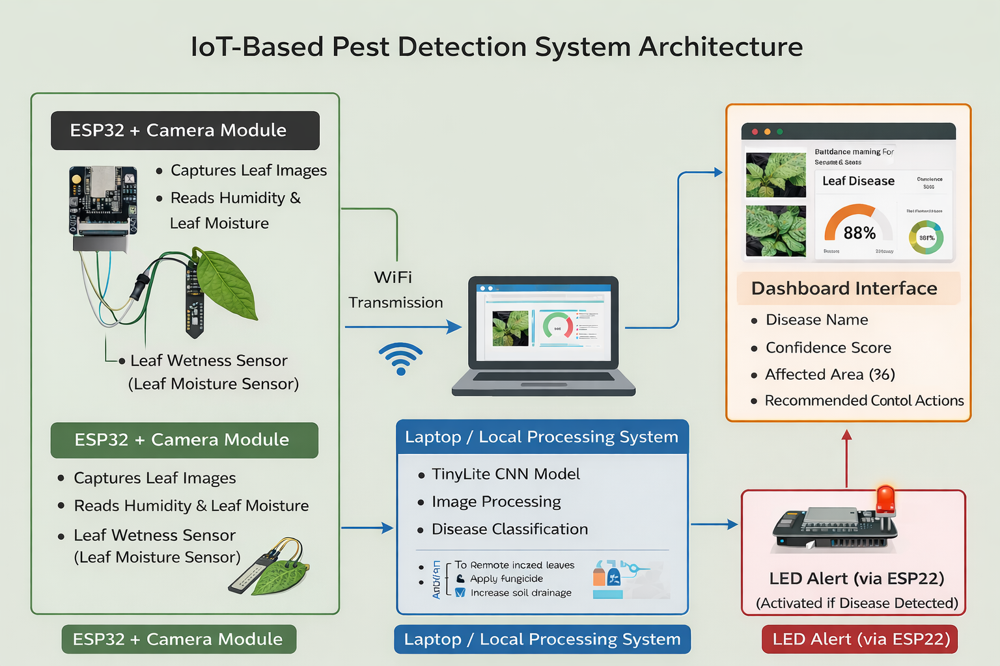

# 🌱 IoT-Powered Pest Detection and Control System Using Image Processing

> 🚜 **IoT-enabled smart agriculture system** for real-time plant disease detection using **ESP32-CAM**, environmental sensors, and a lightweight **TinyLite CNN** inspired by MobileNetV2.

---

# 👨‍💻 Author

**NUKALA AKSHAY**

---

# 📖 Project Overview

Pest infestation and plant diseases are major contributors to reduced agricultural productivity and economic loss. Early detection is critical for minimizing damage, yet current monitoring practices largely depend on manual field inspection, which is time-consuming, labor-intensive, inconsistent, and often reactive rather than preventive. By the time visible symptoms are noticed, crop damage may already be significant.

Existing automated pest and disease detection systems typically fall into two categories:

- ❌ Systems relying only on environmental sensors lack visual confirmation.
- ❌ Deep-learning systems often require computationally expensive models and continuous cloud connectivity.

This project proposes a **low-cost, real-time, scalable IoT solution** combining image processing and environmental sensing while performing efficient local inference.

** Dataset taken from kaggle and name of the DATASET is : PlantVillage**
---

# ✨ Features

- 📷 Real-time plant image capture
- 🌡️ Humidity monitoring
- 🍃 Leaf wetness monitoring
- 🧠 TinyLite CNN (MobileNetV2-inspired)
- 📊 Dashboard visualization
- 🚨 LED alert system
- 📡 WiFi communication
- ⚡ Local AI inference
- 💰 Low-cost deployment

---

# 🏗️ Hardware Requirements

| Availability | Component | Specification / Model | Purpose |
|---|---|---|---|
| ✅ | ESP32-CAM Module | AI Thinker ESP32-CAM | Captures plant images |
| ✅ | Leaf Wetness Sensor | Capacitive Sensor | Measures leaf wetness |
| ✅ | Humidity Sensor | DHT11 / DHT22 | Environmental monitoring |
| ✅ | LED Indicator | Red & Green LEDs | Disease alerts |
| ✅ | Resistors & Jumper Wires | Standard | Circuit connections |
| ✅ | Power Supply | 5V USB Adapter | Power source |
| ✅ | Laptop / PC | 12GB RAM Minimum | Runs AI model & dashboard |
| ✅ | Arduino UNO | Basic | Upload firmware to ESP32-CAM |


---

# 💻 Software Requirements

| Availability | Software / Tool | Version | Purpose |
|---|---|---|---|
| ✅ | Python | 3.9+ | Core programming |
| ✅ | TensorFlow / Keras | 2.x | Model training & inference |
| ✅ | NumPy | Latest | Numerical computing |
| ✅ | Matplotlib / Seaborn | Latest | Visualization |
| ✅ | Kaggle API | Latest | Dataset download |
| ✅ | Kaggle GPU | Latest | Model training |
| ✅ | Arduino IDE | Latest | ESP32 programming |
| ✅ | Flask / Streamlit | Latest | Dashboard |

---

# 📚 Literature Survey

## 👨‍💻 Akshay

- Edge AI enables real-time agricultural monitoring.
- Hybrid edge-cloud architecture improves reliability.
- CNN-based image analysis detects visible disease symptoms.
- Combining image and sensor data improves prediction accuracy.
- Multimodal fusion reduces false positives.
- Image preprocessing improves model performance.
- Dataset quality significantly affects accuracy.
- Continuous IoT monitoring enables early detection.
- Processed insights reduce bandwidth usage.
- Lightweight AI models are ideal for edge devices.

## 👨‍💻 Govardhan

- IoT integrates sensors with image processing.
- PIR sensors detect pest movement.
- Image preprocessing improves detection accuracy.
- Feature extraction enhances pest classification.
- Environmental sensing provides crop health context.
- Raspberry Pi and STM32 are common controllers.
- MQTT enables cloud monitoring.
- Automated pest density estimation improves efficiency.
- Physical pest control reduces pesticide usage.
- Edge processing minimizes bandwidth consumption.

## 👨‍💻 Tagore

- IoT enables automated crop monitoring.
- Environmental sensors improve prediction.
- Camera modules capture plant images.
- CNNs improve disease classification.
- Sensor-image fusion improves reliability.
- Edge computing reduces latency.
- Cloud supports analytics and storage.
- Alert systems notify farmers instantly.
- Continuous monitoring reduces crop loss.
- Lightweight AI suits IoT deployment.

---

# 💡 Proposed Solution

The proposed system is a real-time IoT-based pest and plant disease detection platform integrating:

- 📷 ESP32-CAM
- 🌡️ Humidity sensor
- 🍃 Leaf wetness sensor
- 🧠 TinyLite CNN
- 📊 Dashboard
- 🚨 LED alerts

The ESP32 captures images and sensor readings before transmitting them over WiFi to a laptop where the TinyLite CNN performs disease classification locally.

---

# 🔄 Solution Flow

```text
ESP32 + Camera + Sensors
          │
      WiFi Transfer
          │
          ▼
 Laptop (TinyLite CNN)
          │
          ▼
 Dashboard
          │
          ▼
 LED Alert via ESP32
```

---

# ⚙️ Working Principle

1. 📷 Capture leaf image.
2. 🌡️ Read humidity and leaf wetness.
3. 📡 Send data over WiFi.
4. 🧠 TinyLite CNN classifies the image.
5. 📊 Dashboard displays disease, confidence, affected area, and recommendations.
6. 🚨 ESP32 activates LED when disease is detected.

---

# ⭐ Key Design Features

- Lightweight TinyLite CNN
- Local inference
- Low latency
- WiFi communication
- Cost-effective design
- Scalable architecture

---

## 🏗️ Architecture Diagram



---

# 🎯 Use Cases

- Smart agriculture
- Disease detection
- Greenhouse monitoring
- Farmer decision support
- Research & education
- Low-cost crop monitoring

---

# 🌍 Sustainable Development Goals (SDGs)

| SDG | Goal | Alignment |
|---|---|---|
| 🌾 SDG 2 | Zero Hunger | Improves crop yield through early detection |
| ♻️ SDG 12 | Responsible Consumption | Reduces unnecessary pesticide use |
| 🏗️ SDG 9 | Industry, Innovation & Infrastructure | Promotes AI & IoT innovation |

---

# 📖 References

1. https://www.nature.com/articles/s41598-025-06452-5
2. https://www.ijcce.org/papers/317-CS038.pdf
3. https://ieeexplore.ieee.org/document/10895083

---

⭐ If you found this project useful, consider giving the repository a star.
